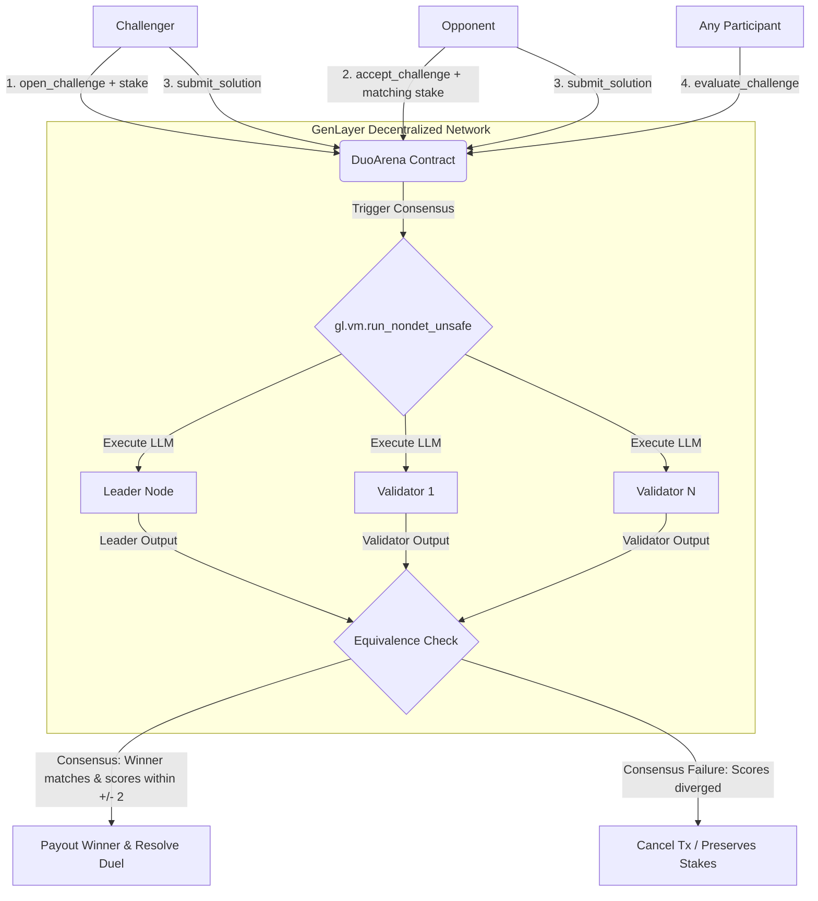

# ✦ Duo — AI-Consensus Challenge Arena

Duo is an elite, decentralized 1v1 challenge and peer-review arena built on GenLayer. It matches developers, writers, designers, and creatives in high-stakes duels where subjective solutions are evaluated by a decentralized panel of AI validators.

🔗 **Vercel Web App:** https://duo-cyan.vercel.app
📜 **Contract (GenLayer Studionet):** `0xe86efF20d158671bdc20B61De432B228cEAAbCb4`

---

## 🎯 The Vision

Traditional smart contracts are limited to objective, structured inputs (such as numbers, addresses, and boolean states). They cannot read a block of code and judge if it is elegant, or evaluate a product description for creativity. Consequently, online competitive arenas either have no stakes or rely on slow, biased, and centralized human referees.

Duo leverages **GenLayer's Intelligent Contracts** to execute subjective judgments trustlessly. Multiple validators run Large Language Models and compare their independent evaluations under the **Equivalence Principle**. This enables an instant, neutral, and secure judging process.

---

## 🔄 Core Protocol Flow

1. **Host a Challenge:** A user selects a category (e.g. Coding), defines the prompt parameters, and stakes a set amount of GEN tokens.
2. **Opponent Acceptance:** Another user matches the staked amount to lock the duel and active matchmaking.
3. **Double Submission:** Both participants draft and submit their answers independently.
4. **AI Verdict & Resolution:** A decentralized validator consensus scores both inputs on Quality, Correctness, and Ingenuity. The higher score secures the entire prize pool, automatically transferred by the contract.



---

## 📜 Contract API Reference

The `DuoArena` contract exposes the following write and view methods:

### Write Methods (State Modifying)
- `open_challenge(category: str, prompt: str) -> i32 (payable)`: Opens a new challenge in the arena. The caller must attach a positive GEN stake.
- `accept_challenge(challenge_id: str) (payable)`: Matches the challenger's stake and locks the challenge to the active matching phase.
- `submit_solution(challenge_id: str, solution: str)`: Allows participants to submit their draft response (allowed during matching or submission phases).
- `evaluate_challenge(challenge_id: str)`: Runs the decentralized AI consensus evaluation. It distributes the combined staked pools to the winner and updates the status to resolved.
- `cancel_challenge(challenge_id: str)`: Allows the challenger to cancel an open challenge before any opponent accepts, returning the full stake.

### View Methods (Read Only)
- `get_challenge(challenge_id: str) -> str`: Returns the full state of the challenge serialized as a JSON string.
- `get_challenge_count() -> i32`: Returns the total number of challenges initialized in the arena.

---

## ⚖️ AI Consensus & Equivalence Principle

Duo enforces a rigorous evaluation framework utilizing the **Equivalence Principle** to guarantee fair and deterministic outcomes on subjective inputs:

1. **Deterministic Prompts:** The contract instructs the LLM to output a strict JSON block structure. Markdown syntax formatting is programmatically stripped and normalized to prevent simple syntax differences from breaking consensus.
2. **Equivalence Bounds Check:** In `validator_fn(leader_result)`, instead of requiring a byte-for-byte match on the entire LLM response, the validators verify that:
   - The winner is identical.
   - The scores assigned to the Challenger and Opponent are within a **±2 margin** of tolerance.
3. **No-Nondet-Leak safety:** The contract fixes linter reachability violations by ensuring the `gl.nondet` calls are kept strictly within `leader_fn`, preventing validators from invoking non-deterministic commands directly in their validation paths.

---

## 🛠️ Local Development & Setup Guide

### Contract Deployment
1. Install the GenLayer CLI:
   ```bash
   npm install -g genlayer
   ```
2. Configure the CLI for the Studio Network:
   ```bash
   genlayer network set studionet
   ```
3. Deploy the contract:
   ```bash
   genlayer deploy --contract contracts/duo_arena.py
   ```

### Frontend Setup
1. Navigate to the frontend directory and install dependencies:
   ```bash
   cd frontend
   npm install
   ```
2. Start the development server:
   ```bash
   npm run dev
   ```
3. Open `http://localhost:3000` to view the web application.

---

## 🎨 UI design & Aesthetics

Duo features a professional, high-end dashboard interface tailored for developers and competitive professionals:
- **Obsidian Dark Mode:** Built using a deep midnight grey background (`#030712`) and slate gray typography, creating a premium visual identity.
- **Glassmorphic Navigation:** Elements incorporate modern CSS backdrop blur filters for a unified, clean overlay experience.
- **Visual Performance Metrology:** The AI consensus verdict panel utilizes interactive progress-meter bars side-by-side to visually display and compare validator scores.
- **Category Colors:** Custom gradients and icons differentiate skill categories dynamically (Indigo for Coding, Pink for Writing, Rose for Design, Green for Math, Amber for Trivia).


